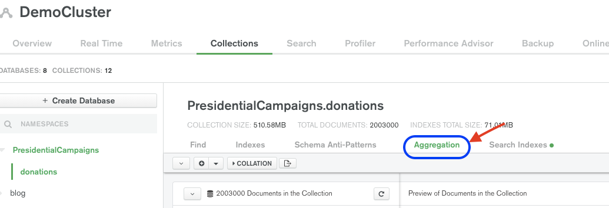
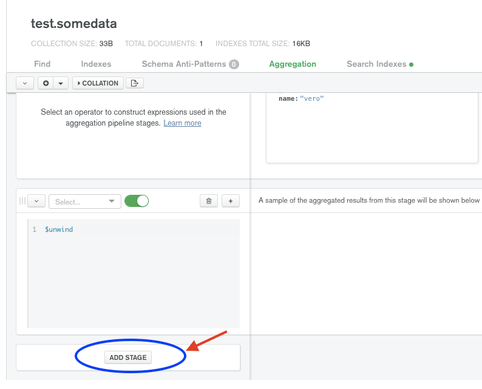

# Aggregation Pipeline

In this exercise, you will use MongoDB’s powerful Aggregation Pipeline to run analytics queries on the collection(s) you created in the previous exercise. 

***You have received the following requests from your marketing team:***
> 1. Find out the **average call duration by Gender** across all subscribers

> 2. Find out the **Peak Calling Hour** by analysing the total number of calls made per hour by all subscribers (Note: Group the data by hour, starting from 00 to 23

## Useful Operators:

### Aggregation Exercise 1:

**Aggregation Stages**

> [$unwind](https://docs.mongodb.com/manual/reference/operator/aggregation/unwind/) - Used to unwind array fields (i.e. work with array values on an individual basis)

> [$group](https://docs.mongodb.com/manual/reference/operator/aggregation/group/) - Used to group or summarise data (e.g. generate a count value)

**Aggregation Operators**

> [$avg](https://docs.mongodb.com/manual/reference/operator/aggregation/avg/) - Used to get an average of number values

> [$sum](https://docs.mongodb.com/manual/reference/operator/aggregation/sum/) - Used to add multiple number values together

### Aggregation Exercise 2:

**Aggregation Stages**

> [$unwind](https://docs.mongodb.com/manual/reference/operator/aggregation/unwind/) - Used to unwind array fields (i.e. work with array values on an individual basis)

> [$project](https://docs.mongodb.com/manual/reference/operator/aggregation/project/) - Used to include/exclude/alter specific fields

> [$dateFromString](https://docs.mongodb.com/manual/reference/operator/aggregation/dateFromString/) - Used to create a date value from a string

> [$dateToParts](https://docs.mongodb.com/manual/reference/operator/aggregation/dateToParts/) - Used to separate a date value into its parts (e.g. day, hour, minute etc)

> [$sum](https://docs.mongodb.com/manual/reference/operator/aggregation/sum/) - Used to add multiple number values together

## Useful Links:
1. SQL to MongoDB Mapping Chart: https://docs.mongodb.com/manual/reference/sql-comparison/
2. SQL to Aggregation Mapping Chart: https://docs.mongodb.com/manual/reference/sql-aggregation-comparison/ 
3. Aggregation Pipeline Quick Reference: https://docs.mongodb.com/manual/meta/aggregation-quick-reference/

## Instructions:

In order to build out your aggregation pipeline, you can use the following ways:
1. Navigate to the ‘Aggregation’ tab under ‘Collections’ in your cluster 

> 

   - Click on the ‘Add Stage’ button and start building out your aggregation pipeline stage-by-stage. You can also preview a sample of the aggregated results on the side. You can continue to add more stages by using the ‘Add Stage’ button.

2. Alternatively, you can utilise MongoDB Compass for the same. Navigate to the ‘Aggregations’ tab once you’re inside your collection

> 

   - Click on the ‘Add Stage’ button and start building out your aggregation pipeline stage-by-stage. You can also preview a sample of the aggregated results on the side. You can continue to add more stages by using the ‘Add Stage’ button.

## Solutions
Once finished you can compare your result with the solutions:
* [Aggregation 1](https://github.com/mcinteerj/rdbms-mdb-migration-workshop/blob/main/guides/solutions/Aggregation/Aggregation1.md)
* [Aggregation 2](https://github.com/mcinteerj/rdbms-mdb-migration-workshop/blob/main/guides/solutions/Aggregation/Aggregation2.md)

## Next Step

Once you have completed both aggregations, you're ready to head to the next step: [MongoDB Charts](../charts/).
