Return to the easy guide [here](..).

# Section 4: Visualisation using MongoDB Charts
Visualise the data you loaded into your MongoDB Atlas cluster in [step 2](../data-migration) using MongoDB Charts.

## Instructions
MongoDB Charts is included as part of the MongoDB Cloud platform and can be accessed through the Atlas platform. The following steps will help you get started:

* Click on the ‘Charts’ tab on your Atlas Cluster Screen
> 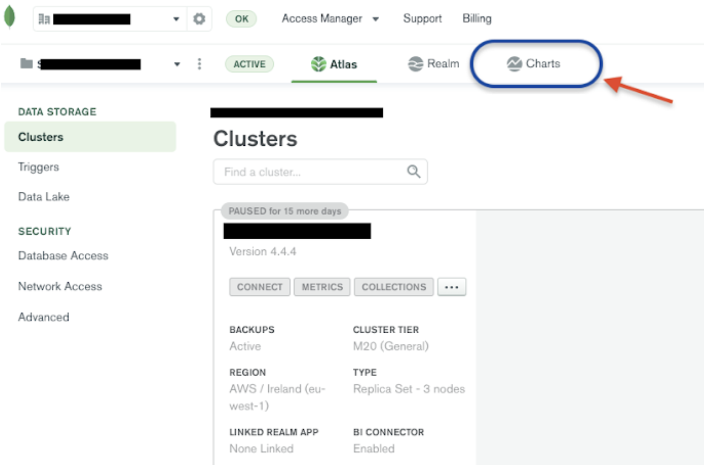

* Create a new Dashboard in the Charts Tab by clicking on the ‘Add Dashboard’ button. 
> 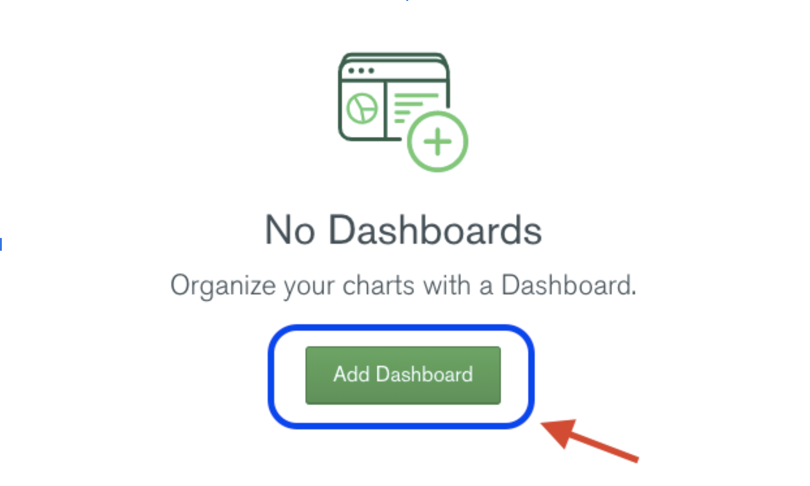

* In the popup, enter the ‘Title’ of your Dashboard, and a ‘Description’. Once you’re done, click on the ‘Create’ button.
> 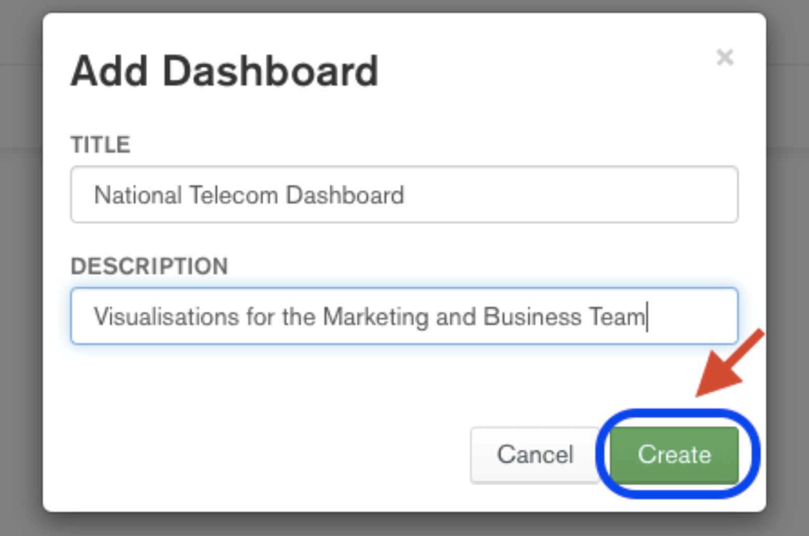

* Once the Dashboard creation is complete, your dashboard would be automatically opened, If not, click on your created dashboard under the ‘Dashboards’ heading.
> 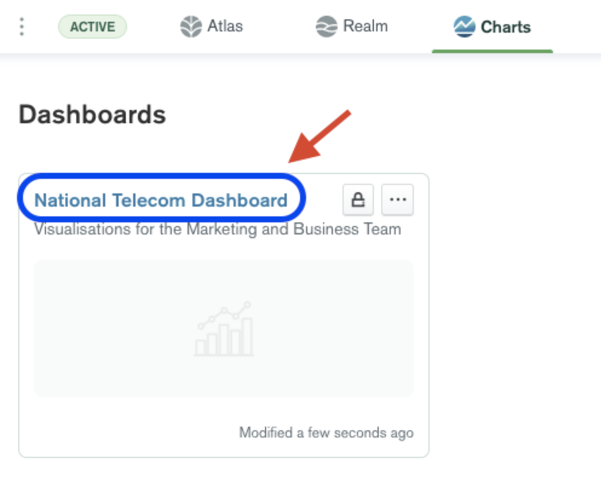

* Once inside the dashboard, you will see a series of pop-ups as a part of the instructions wizard. For each pop-up, click on ‘OK’ or ‘Next’ to proceed. As an example, the first such pop-up is shown below.
> 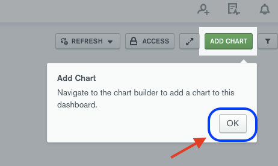

* Next, click on the ‘Add Chart’ button 
> 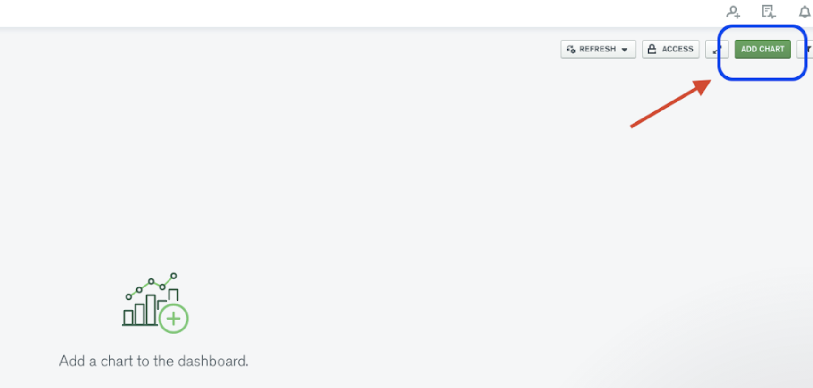

* In the create chart screen, start by selecting your Collection as the ‘Data Source’
> 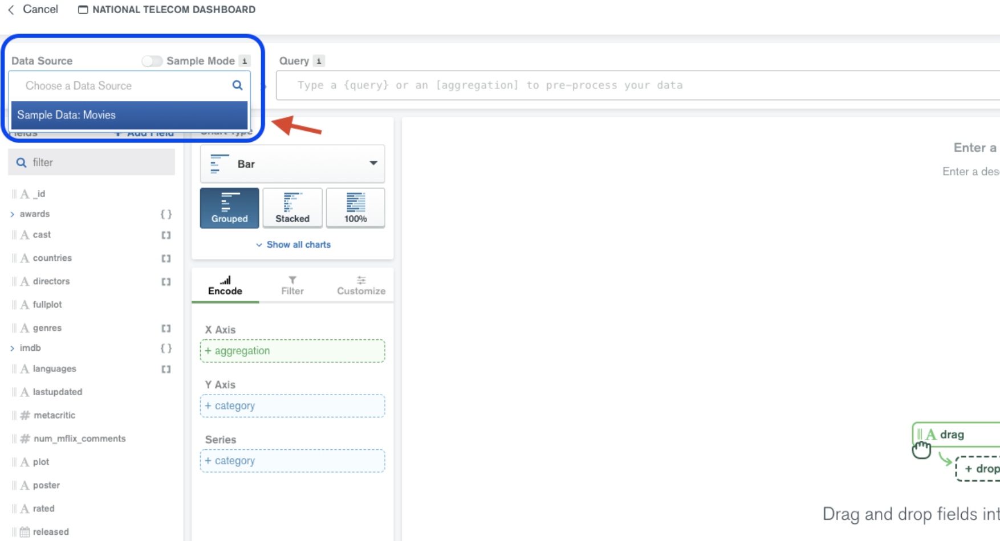

* Select the type of the chart you wish to create from the ‘Chart Type’ drop-down menu
> 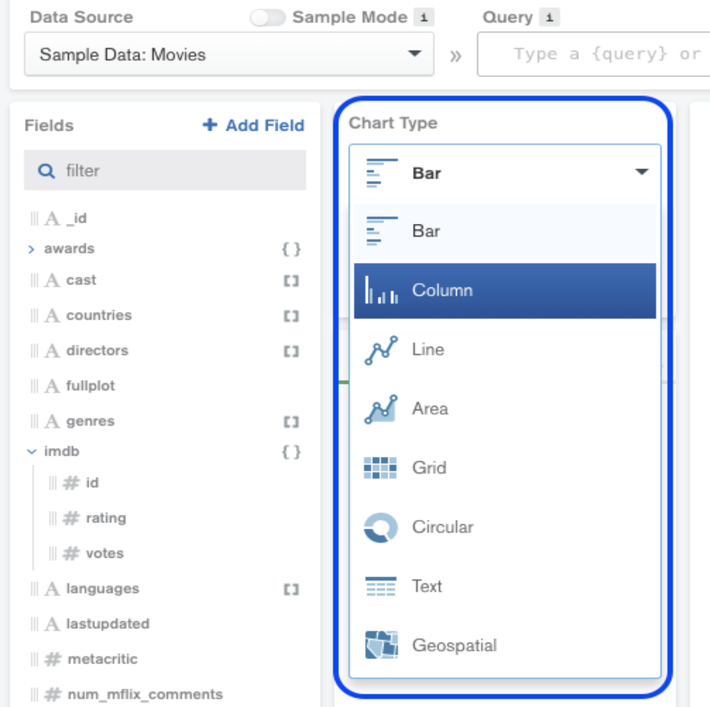

* You can put in your aggregation query into the ‘Query’ bar to pre-aggregate data to be visualised
> 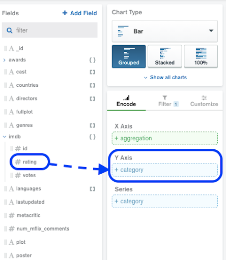

* You can also drag and drop fields into the encoding panel and select the relevant details based on your Chart type
> 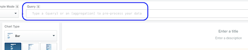

* In case you accidentally select a wrong field, you can click on the bin icon as shown below to delete it.
> 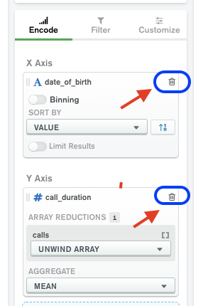

You are now ready to make the vizualisation of your aggregations.

## Visualising the first Aggregation Exercise: Average Call Duration by Gender

* Select the `Hackathon.customers` collection as your data source
* From the ‘Chart Type’ drop-down, select **Column**, and select the **Grouped** type.
* Drag the `gender` field from the **Fields** panel on the left to the X-Axis field in the **Encode** tab. In the **Sort By** drop down, select **Value**  
* Drag the `call_duration` field from the **Fields** panel on the left (note: this field can be found under `calls`) to the Y-Axis field in the **Encode** tab.
* In the **Array Reductions** drop down for calls, choose the method `Unwind Array`. This is done to obtain one document per call.
* Then, from the **Aggregate** drop down, select **Mean**.
* This is what the configuration panel should look like: 
> 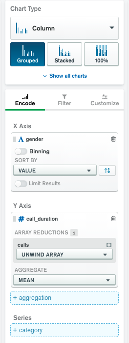
* You should now see a Chart on your screen
* Optionally, you can go to the **Customize** tab and enable **Data Value Labels** under the **Chart Elements**. You can also play around with colours and other visual features.  
* Finally, you can give your chart a title by editing the **Enter a title** field, and you may also add a description by editing the **Enter a description** field on the chart.
* Once you are done, you can compare your solution to the sample solution provided [here](https://github.com/mcinteerj/rdbms-mdb-migration-workshop/blob/main/guides/solutions/Charts/Charts_Exercise1_Result.png). 

## Visualising the second Aggregation Exercise: Total Calls per Hour of the Day

* Select the `Hackathon.customers` collection as your Data Source
* Select **Column** from the Chart Type drop-down list, and then select the type **Grouped**
* In the **Query** field, paste the aggregation query from Exercise 3.1. This is done to pre-process your data. One such possible query could be: 
```
db.customers.aggregate(
[{$unwind: {
  path: "$calls"
}}, 
{$project: {
"dateasdate":
{"$dateFromString":
{dateString:"$calls.date"}}
}}, {$project: {
  "dateasparts":{"$dateToParts":{date:"$dateasdate"}}
}}, {$group: {
  _id: "$dateasparts.hour",
  count: {
    $sum:1
  }
}}]
)
```
* You would notice that after the filtering, only two fields are now available under the ‘Fields’ panel on the left - `_id` and `count`
* Drag the `_id` field to the X-Axis variable in the **Encode** tab. You will notice that it automatically enables ‘Binning’, but since we wish to visualise the `count` for each hour, we wouldn’t need to use it. Therefore, disable **Binning** 
* Drag the `count` field to the Y-Axis. From the **Aggregate** drop-down, select `SUM`, as we require the total number of calls for each hour. 
* This is what your configuration panel should look like:
> 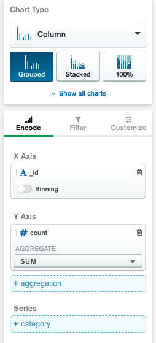
* You should now be able to see a column chart on your screen 
* Optionally, you can go to the **Customize** tab and enable **Data Value Labels** under the **Chart Elements**. You can also play around with colours and other visual features. 
* Finally, you can give your chart a title by editing the **Enter a title** field, and you may also add a description by editing the **Enter a description** field on the chart.

Once you are done, you can compare your solution to the sample solution provided [here](https://github.com/mcinteerj/rdbms-mdb-migration-workshop/blob/main/guides/solutions/charts)

## Complete

Congratulations! You've finished all of the exercises. Click [here](https://github.com/mcinteerj/rdbms-mdb-migration-workshop/) to return to the home of this repository.
