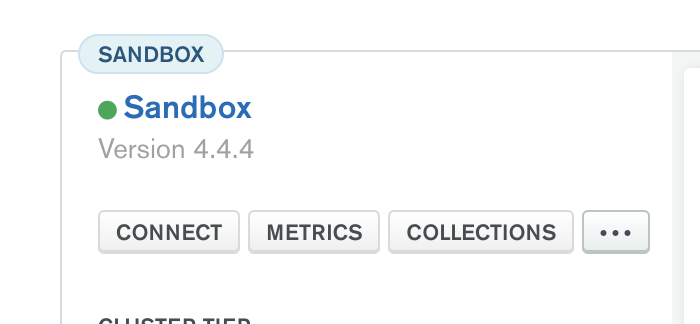
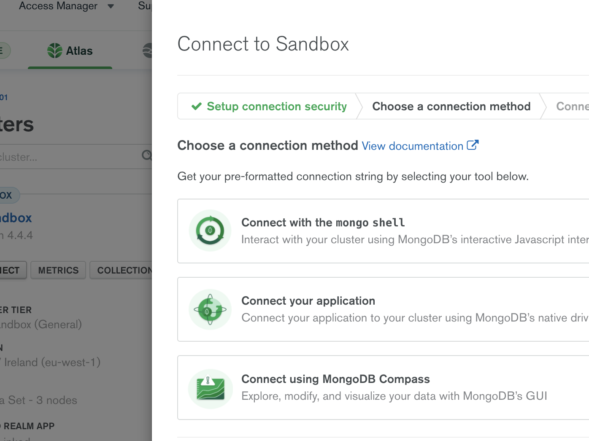

Return to the root of the easy guide [here](..).

# Overview

The goal of this section is to migrate data from MySQL to MongoDB Atlas and ensure that the data is transformed through the migration process into an data model optimised for MongoDB.

There are many commercial ETL tools provided by third parties which can be used for this purpose. For this exercise, we will use a simple, open source tool known as [MongoSyphon](https://github.com/johnlpage/MongoSyphon) which is available on GitHub. 

**Disclaimer:** MongoSyphon is an Open Source tool that is not supported (officially and otherwise) by MongoDB. Information contained in this readme may not reflect the full process behind the program or any enhancements that may be made to it by its contributors in the future.

# MongoSyphon
In this section we will migrate the data from the Relational Database through MongoSyphon to MongoDB Atlas.

You can find the MongoSyphon.jar file and Config.js template in the [Resources Folder](../../../resources/). The detail below explains how to configure and run MongoSyphon in order to migrate your data. 

Your goal is to create a config.js file which MongoSyphon can use to extract data from  MySQL and transforms it inflight in order to load the data into MongoDB in the data model you created in the [Data Modelling Exercise](../data-modelling/). 

## Template and how it works

The follwing examples/explanation comes from the official [MongoSyphon GitHub](https://github.com/johnlpage/MongoSyphon) where you can also find more detailed documentation. 

```
>cat owners.js
{
	start: {
		source: {
			uri:  "jdbc:mysql://localhost:3306/sdemo?useSSL=false",
			user: "root",
			password: "password"
		},
		target: {
			mode: "insert",
			uri: "mongodb://localhost:27017/",
			namespace: "sdemo.owners"
		},
		template: {
			_id: "$ownerid",
			name: "$name",
			address : "$address",
			pets : [ "@petsection" ]
		},
		query:{
		   sql: 'SELECT * FROM owner'
		}
	},

	petsection: {
		template: {
			petid: "$petid",
			name: "$name",
			species : "@speciessection"
		},
		query:{
			sql: 'SELECT * FROM pet where owner = ?'
		},
		params: [ "ownerid" ]
	},

	speciessection: {
		template: {
			_value : "$species"
		},
		query: {
			sql: 'SELECT * from species where speciesid = ?'
		},
		params : [ "species" ]
	}
}
```

As we can see the template is self-describing and therefore quite intuitive to understand.

There is the first section which is "start" and then whichever you need.

In this exemple we can see the other 2 added sections are petsection and speciessection.

## Source 

The source is the connection string and values to your source Database. In this case it is a MySQL Database made for this exercise.

```
source: {
        uri:  "jdbc:mysql://database",
        user: "user",
        password: "pass",
    }
```

## Target

The target is the connection string and values to your MongoDB Database. You will have to replace the value with your connection string in the uri field.
The namespace field correspond to the database.

```
    target : {
      mode: "insert",
      uri:"mongodb+srv://<user>:<pass>@yourURI?retryWrites=true&w=majority",
      namespace: "<db_name>.<collection_name>"
    }
```

## Query

The query is the query made on the source Database. For this exercises they will be done in sql.

```
  query: {
      sql:'SELECT * FROM owner'
  }
```

## Template

Each section has a template which is written following this syntax:

```
template:{
 "one-field":"$value"
}
```

As we can see each field has a name and his value. Both of which have to be in between "".
For the values, there are two possibilities: either the $ sign to get the value of the field named or the @ sign that gets the value from the section called.
The type of the value will depend on the data source but you are able to force a field to be either an [array,] or an {object:object,}.
This is useful to follow the wanted schema and for the one to many relations.

# National Telecom Template
Now that you have an understanding of the config file, we can start making one for this exercise.

Use this [sample/skeleton template](https://github.com/mcinteerj/rdbms-mdb-migration-workshop/blob/main/resources/template-config.json) in order to configure MongoSyphon to migrate your data. The steps below go through how to set up each section of the configuration file. 


## Source
The first section of the template is already completed for you as follows:
```
"source": {
    "uri": "jdbc:mysql://database-1.cb7xvxwyioz4.eu-west-3.rds.amazonaws.com:3306/telecom?useUnicode=true&useServerPrepStmts=true&useSSL=false",
    "user": "bt-hack",
    "password": "btgameday123!march2021"
}
```

This specifies the required parameters to connect to the MySQL server that you will be extracting data from. We have provided all of the required credentials and connection parameters - you do not need to edit this.

## Target
The next section of the template is the `target` section which specifies the parameters required to connect to your Atlas Cluster:
```
"target": {
    "mode": "insert",
    "uri": "<Atlas Connection String>",
    "namespace": "<db_name>.<coll_name>"
}
```

The `mode` field can be left to it's current value of `insert` as we will be inserting data into MongoDB. 

The `uri` field needs the MongoDB Connection string to be added, including your credentials. If you already have a MongoDB Atlas cluster running (e.g. that have previously used as part of this workshop), you should use it for this exercise - otherwise you will need to create your own. 

To find your connection string, you will have to go to your cluster's page and click on the "Connect" button:

> 

"Connect your application" choose the Java driver for the 3.6 version (which is used by MongoSyphon). 

> 

At this point, you can click on the copy button and put it in the uri field being **careful to change the <user> and <password> value**.

> 

Finally, you will need to adjust the `namespace` field in order to set the database and collection name you wish to use for this data. You could use 'telecom' as the DB name and 'customers' as the collection name, like so:
```
    "namespace": "telecom.customers"
```

## Template

The next section to complete is the `template` section. This specifies the target document structure which will match the data model you defined in the earlier exercise. 

You will be able to copy in the sample document you create during the data modelling exercise and then update it to use placeholders for the relevant columns in the RDBMs. You can set these placeholders using the format `$column_name`

See the following example template:

```
template: {
    "_id": "$subscriber_id",
    "gender": "$gender",
    "name": "$name",
    "email": "$email",
    "phone_number":"$phone_number",
    "date_of_birth": "$date_of_birth",
    "address": {
        "street": "$street", 
        "zip":"$zip", 
        "city":"$city", 
        "country_code":"$country_code"
    }
}
```

Output:

```

{
    "_id":"S000000100",
    "date_of_birth":"1929-09-12",
    "email": "deermeat1961@protonmail.com",
    "gender": "M",
    "name": "Alexander Hodges",
    "phone_number": 056 2126 1927,
    "address":{
        "street":"426 Estate Walk",
        "zip":"DL8Z 0ST",
        "city":"Monmouth",
        "country_code":"UK"
    }
}
```

## Query

For this exercise in the start section the query will be `'SELECT * FROM customers'` because we want to build our MongoDB Database with one document per Customer. This query will return all of the values contained in the customers table.

```
  query: {
      sql: 'SELECT * FROM customers'
  }
```

You can try the query on your MySQL shell to see what the data looks like.

Now that leaves us with the following problem:

> How can we get values from the other tables?

## Sections
To generate data in the schema we want, we need to get the calls and embed them to the right suscriber's document.

That's where the sections come in. MongoSyphon enables you to get a field's value from a section where you can give another template and another query.

### Calls Section
To this end, we are making the `"@callssection"` where we will query the calls and put them into the right document. You can query the calls table in your MySQL shell if you want to see what the data look like.

```
Calls

subscriber_id | rate_plan_id | connected_party_num | call_duration | date_time_stamp
------------------------------------------------------------------------------------
```

Our callssection following the table will be like this:

```
callssection: {
    template: {
        "call_duration": "$call_duration",
        "date": "$date_time_stamp",
        "connected_party_num": "$connected_party_num"
    },
    query: {
        sql: 'SELECT * FROM calls where subscriber_id=?'
    },
    params: [ "subscriber_id" ]
}
```

For the keen eye, you will observe that we used a **parameter**. That is because we want to make the link between the customer and the calls.

With that query MongoSyphon will use the parameter for each subscriber_id will give us all their calls.

To call that section, you simply put another field in your start section's template as following:

```
template: {
      "subscriber_id": "$subscriber_id",
      "gender": "$gender",
      "name": "$name",
      "email": "$email",
      "phone_number":"$phone_number",
      "date_of_birth": "$date_of_birth",
      "address": {
          "street": "$street",
          "zip":"$zip", 
          "city":"$city", 
          "country_code":"$country_code"
      },
      "calls": [ "@callssection" ]
    }
```

Output:

```
{
    "_id":"S000000100",
    "address": {
        "street": "426 Estate Walk",
        "zip": "DL8Z 0ST",
        "city": "Monmouth",
        "country_code": "UK"
        },
    "date_of_birth": "1929-09-12",
    "email": "deermeat1961@protonmail.com",
    "gender": "M",
    "name": "Alexander Hodges",
    "phone_number": "056 2126 1927",
    "calls": [ {
        "call_duration": "3",
        "date": "1926-10-01 04:12:20",
        "connected_party_num": "01093 136241"
    },    
    {
        "call_duration": "229",
        "date": "1928-03-25 02:15:39",
        "connected_party_num": "019337 08684"
    },
    {
        "call_duration": "900",
        "date": "1930-02-22 02:26:34",
        "connected_party_num": "0303 864 8723"
    },
   ...]
}
```

### Rate Plan Section
Now there is only the rate_plan left. Our Relational Database has another table which is linked to the calls' one.

For that we can use the previously learned function **nested** in the `callssection`.

Here is now our `callssection`:

```
callssection: {
    template: {
        "call_duration": "$call_duration",
        "date": "$date_time_stamp",
        "rate_plan_id": "@rateplansection",
        "connected_party_num": "$connected_party_num"
    },
    query: {
        sql:'SELECT * FROM calls where subscriber_id=?'
    },
    params: [ "subscriber_id" ]
}
```

Now that you are used to all of the main elements here is the `rateplansection`, as previously, you can query the rate_plan table from your MySQL shell to see what the data looks like:

```
rateplansection:{
    template:{
        "description":"$description",
        "type":"$type"
    },
    query:{
        sql:'SELECT * FROM rate_plan where rate_plan_id=?'
    },params:["rate_plan_id"]
}
```
You are now all set to do the migration.
If you are unsure about your file, you can get the [Solution](https://github.com/mcinteerj/rdbms-mdb-migration-workshop/blob/main/guides/solutions/DataMigration/DataMigrationSolution.json)

## Executing the Migration
Download the MongoSyphon.jar file from [here](https://github.com/mcinteerj/rdbms-mdb-migration-workshop/raw/main/resources/MongoSyphon.jar).

To run MongoSyphon, you simply call it with the java command. For example, in order to print the 'help' information for MongoSyphon, you could run:
```
java -jar ./MongoSyphon.jar --help
```

Assuming that the jar file is in the same directory as your config file you can execute the following command in order to execute the migration:

```
java -jar ./MongoSyphon.jar -c ./config.json
```

After some time (<1 min) you should see the following message:

```
100 records converted in 29 seconds at an average of 3 records/s
```

If you hit any issues at this point, please see [Troubleshooting: Common Issues](../../../troubleshooting/) or ask for help.

You are done! Your data is now on your cluster with the right schema to go through the next step.

## Next Step

Once you have completed both aggregations, you're ready to head to the next step: [MongoDB Aggregations](../aggregations/).
