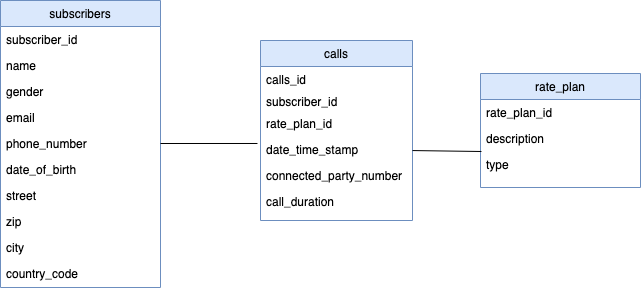

Return to the root of the easy guide [here](..).

# MongoDB Schema Design

Using the relational database schema as a reference for the dataset, design the MongoDB Schema which would be used by the Customer Billing System. 

While designing the MongoDB Schema, it is important to keep in mind that it should not be a JSON version of your Relational Database Schema. MongoDB Schemas are designed based on the most common queries sent to the database by the application(s) that will be using them. It’s therefore necessary to think about how the Customer Billing System is accessing the data by focussing on the queries it runs most frequently. 

This is a very different approach to just considering the relationships in the data itself as you would if you were going through a normalisation process - so it might feel a little weird.  


## Data Modelling Basics: 

MongoDB Documents are designed in the same way as JSON documents, and have the following format: 

```
{
   'field1': value1,
   'field2': value2,
   'field3': value3,
   ...
   'fieldN': valueN
}
```

As an example, consider the following document storing customer data, which contains values of varying types: 

```
{
   '_id': ObjectId("5099803df3f4948bd2f98391"),
   'name': { first: "Alan", last: "Turing" },
   'birth': { '$date': '1912-06-23' },
   'email': [ "at@gmail.com", "alant@yahoo.com” ]
}
```

MongoDB documents are of the type BSON (Binary JSON). For a complete list of data types supported in BSON documents, refer to this link: [https://docs.mongodb.com/manual/reference/bson-types/](https://docs.mongodb.com/manual/reference/bson-types/) 

## Expected Output
The output of this exercise should be a JSON sample document that is an example of how you will structure the data in MongoDB. It should looking something like this (but of course contain fields/data from the relational system):

```
{
   'string_field': "string value",
   'array_strings_field': ["array", "of", "string", "values"],
   'array_objects_field': [{'string_field': "string value 1"}, {'string_field': "string value 2"}]
}
```

## Relational Schema

> 

If you are familiar with SQL and want to look directly at the data in the MySQL database, you can connect using the following parameters:
```
{
    "uri": "jdbc:mysql://database-1.cb7xvxwyioz4.eu-west-3.rds.amazonaws.com:3306/telecom?useUnicode=true&useServerPrepStmts=true&useSSL=false",
    "user": "bt-hack",
    "password": "btgameday123!march2021"
}
```

For example, **if** connecting you have the MySQL command line client installed, you could use the following command (note: this is optional for those who want to connect directly to the source DB and already have a client installed):
```
mysql -h database-1.cb7xvxwyioz4.eu-west-3.rds.amazonaws.com -P 3306 -u bt-hack --password='btgameday123!march2021'
```

You could then run commands such as:
```
SHOW DATABASES;

USE telecom;

SHOW TABLES;

SELECT * FROM customers LIMIT 5;
```

You could also use GUI based products like [MySQL Workbench](https://dev.mysql.com/doc/workbench/en/) if that was preferable. However this is not required as we have documented the key information about the telecom database in below:

### Customers Table

```
mysql> select * from customers limit 1;
```

```
+---------------+--------+---------------+------------------------+--------------+---------------+-------------------+----------+------+--------------+
| subscriber_id | gender | name          | email                  | phone_number | date_of_birth | street            | zip      | city | country_code |
+---------------+--------+---------------+------------------------+--------------+---------------+-------------------+----------+------+--------------+
| S000000999    | F      | Jane Doe      | jane123@gmail.com      | 019557 58345 | 1921-03-29    | 570 Earhart Trail | VL7M 7ZG | Bury | UK           |
+---------------+--------+---------------+------------------------+--------------+---------------+-------------------+----------+------+--------------+
```

### Calls Table

```
mysql> select * from calls limit 1;
```

```
+---------------+---------------+--------------+---------------------+---------------+---------------------+
| call_id       | subscriber_id | rate_plan_id | connected_party_num | call_duration | date_time_stamp     |
+---------------+---------------+--------------+---------------------+---------------+---------------------+
| C000000001    | S000000999    | RP00000001   | 0534 052 0241       |           790 | 2020-03-29 20:40:16 |
| C000000002    | S000000999    | RP00000001   | 0220 381 9343       |          1061 | 2020-04-13 18:32:24 |
+---------------+---------------+--------------+---------------------+---------------+---------------------+
```

### Rate Plans Table

```
mysql> select * from rate_plan limit 1;
```

```
+--------------+------------------+------+
| rate_plan_id | description      | type |
+--------------+------------------+------+
| RP00000001   | Phone calls only | A    |
+--------------+------------------+------+
```

## Instructions
Use your favourite text editor to create a sample JSON document for the relational schema specified above. 

Keep in mind that the database supports a Customer Billing System - **the most common query on this system is retrieving the entire record (including call and rate plan details) for a given customer ID**.

### Hints

* Data from all three tables should be **denormalized** into a single document
* [This blog](https://developer.mongodb.com/article/mongodb-schema-design-best-practices/) is a good example of how it should look (pay particular attention to embedding!)
* For the purposes of this exercise, you can assume that there will be a **maximum of 50 calls associated with each customer** - in other words, the number of fields is 'bounded' at 50 and hence it may be appropriate to have them all in a single array field.

### Solution

Once you’ve created your sample, see here to compare it to our [solution](https://github.com/mcinteerj/rdbms-mdb-migration-workshop/blob/main/guides/solutions/data-modelling). 

## Next Step

Once you have identified the appropriate target schema you'd like to use in MongoDB (which should match our solution above), you're ready to head to the next step: [Data Migration](../data-migration/).
