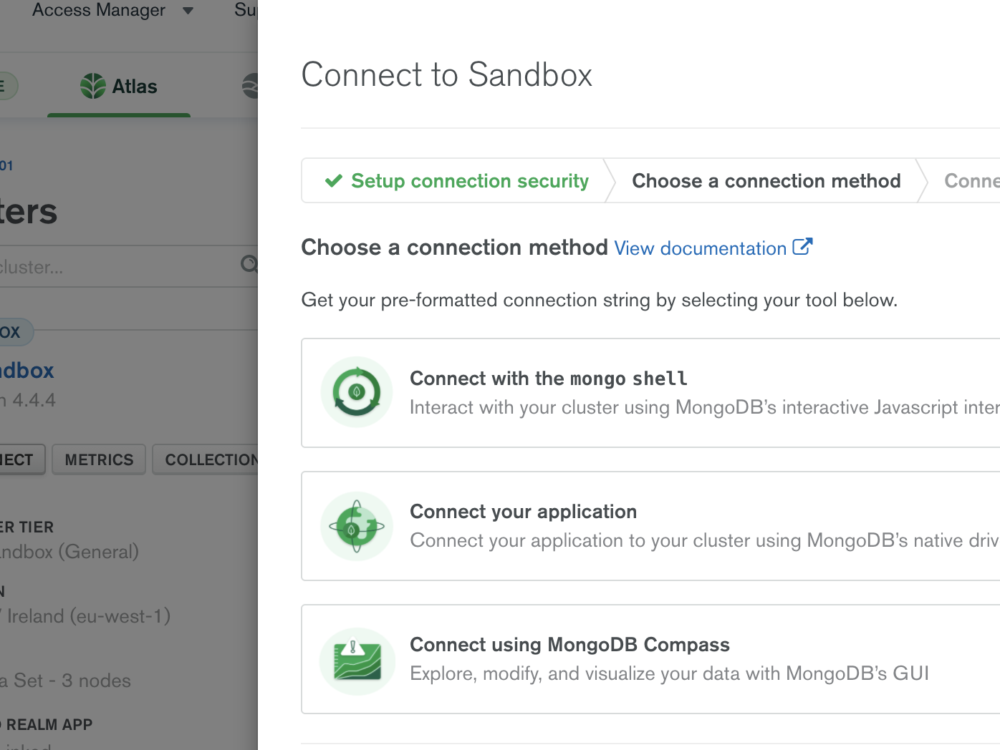

# Overview

In this section the goal is to migrate the data from the Relationnal Database to MongoDB.


## [Config.js](https://github.com/mcinteerj/rdbms-mdb-migration-workshop/blob/main/resources/MongoSyphonRessources/configs/Hackathon.js) template and how it works

The follwing example comes from the official MongoSyphon GitHub.

```
>cat owners.js
{
	start: {
		source: {
			uri:  "jdbc:mysql://localhost:3306/sdemo?useSSL=false",
			user: "root",
			password: "password"
		},
		target: {
			mode: "insert",
			uri: "mongodb://localhost:27017/",
			namespace: "sdemo.owners"
		},
		template: {
			_id: "$ownerid",
			name: "$name",
			address : "$address",
			pets : [ "@petsection" ]
		},
		query:{
		   sql: 'SELECT * FROM owner'
		}
	},

	petsection: {
		template: {
			petid: "$petid",
			name: "$name",
			species : "@speciessection"
		},
		query:{
			sql: 'SELECT * FROM pet where owner = ?'
		},
		params: [ "ownerid" ]
	},

	speciessection: {
		template: {
			_value : "$species"
		},
		query: {
			sql: 'SELECT * from species where speciesid = ?'
		},
		params : [ "species" ]
	}
}
```

As we can see the template is fairly intuitive.
There is the first section which is "start" and then whichever you need.
In this exemple we can see the other 2 added sections are petsection and speciessection.

## Source 

The source is the connection string and values to your source Database. In this case it is a MySQL Database made for this exercise.

```
source: {
        uri:  "jdbc:mysql://database",
        user: "user",
        password: "pass",
    }
```

## Target

The target is the connection string and values to your MongoDB Database. You will have to replace the value with your connection string in the uri field.
The namespace field correspond to the database.

```
    target : {
      mode: "insert",
      uri:"mongodb+srv://<user>:<pass>@yourURI?retryWrites=true&w=majority",
      namespace: "hackathon.customers"
    }
```

## Query

The query is the query made on the source Database. For this exercises they will be done in sql.

```
  query: {
      sql:'SELECT * FROM customers'
  }
```

## Template

Each section has a template which is written following this syntax:

```
template:{
 "one-field":"$value"
}
```

As we can see each field has a name and his value. Both of which have to be in between "".
For the values, there are two possibilities: either the $ sign to get the value of the field named or the @ sign that gets the value from the section called.
The type of the value will depend on the data source but you are able to force a field to be either an [array,] or an {object:object,}.
This is useful to follow the wanted schema and for the one to many relations.

# Our schema
## Connection

Now that you have more informations about the config file, we will start making the one for our exemple.
The first step is the connection.

For this step, you will have to go to your cluster's page and click on the "Connect" button,

> 
                                                                                                                                    
"Connect your application" choose the Java driver for the 3.6 version. 

> 

At this point, you can click on the copy button and put it in the uri field being careful to change the <user> and <password> value.

> 

## Query

For this exercise in the start section the query will be **'SELECT * FROM customers'** because we want to build our MongoDB Database with one document per Customer.
This query will return all of the values countained in the customers table.
You can try the query on your MySQL shell to see what the data looks like.

## Template

From our schema we can see that the Customer table has 10 Columns:

```
Customers

subscriber_id | gender | name | email | phone_number | date_of_birth | street | zip | city | country_code
---------------------------------------------------------------------------------------------------------
```


This gives you the following template:

```
  template: {
      "_id": "$subscriber_id",
      "gender": "$gender",
      "name": "$name",
      "email": "$email",
      "phone_number":"$phone_number",
      "date_of_birth": "$date_of_birth",
      "address":{
        "street": "$street", 
        "zip":"$zip", 
        "city":"$city", 
        "country_code":"$country_code"
        },
    }
```

Output:

```

{
    "_id":"S000000100",
    "address":{
        "street":"426 Estate Walk"
        "zip":"DL8Z 0ST"
        "city":"Monmouth"
        "country_code":"UK"
        },   
    "date_of_birth":"1929-09-12",
    "email": "deermeat1961@protonmail.com",
    "gender": "M",
    "name": "Alexander Hodges",
    "phone_number": 056 2126 1927,
    
}
```

Now that leaves us with the following problem:
How can we get values from the other tables?
To realize the schema we want to get the calls and embed them to the right suscriber's document.
That's where the sections come in.
MongoSyphon enables you to get a field's value from a section where you can give another template and another query.
To this end, we are making the "@callssection" where we will query the calls and put them into the right document.
You can query the calls table in your MySQL shell if you want to see what the data look like.

```
Calls

subscriber_id | rate_plan_id | connected_party_num | call_duration | date_time_stamp
------------------------------------------------------------------------------------
```

Our callssection following the table will be like this:

```
callssection:{
    template:{
        "call_duration":"$call_duration",
        "date":"$date_time_stamp",
        "connected_party_num":"$connected_party_num"
    },
    query: {
        sql:'SELECT * FROM calls where subscriber_id=?'
    },params:["subscriber_id"]
}
```

For the keen eye, you will observe that we used a **parameter**. That is because we want to make the link between the customer and the calls.
With that query MongoSyphon will use the parameter for each subscriber_id will give us all their calls.

To call that section, you simply put another field in your start section's template as following:

```
template: {
      "subscriber_id": "$subscriber_id",
      "gender": "$gender",
      "name": "$name",
      "email": "$email",
      "phone_number":"$phone_number",
      "date_of_birth": "$date_of_birth",
      "address":{
          "street": "$street",
          "zip":"$zip", 
              "city":"$city", 
                  "country_code":"$country_code"
      },
      "calls": ["@callssection"]
    }
```

Output:

```
{
    "_id":"S000000100",
    "address":{
        "street":"426 Estate Walk",
        "zip":"DL8Z 0ST",
        "city":"Monmouth",
        "country_code":"UK"
        },
    "date_of_birth":"1929-09-12",
    "email":"deermeat1961@protonmail.com",
    "gender":"M",
    "name":"Alexander Hodges",
    "phone_number":"056 2126 1927",
    "calls":[{
        "call_duration":"3",
        "date":"1926-10-01 04:12:20",
        "connected_party_num":"01093 136241"},
        
        {"call_duration":"229",
        "date":"1928-03-25 02:15:39",
        "connected_party_num":"019337 08684"},
        
        {"call_duration":"900",
        "date":"1930-02-22 02:26:34",
        "connected_party_num":"0303 864 8723"},
   ...
}
```

Now there is only the rate_plan left. Our Relational Database has another table which is linked to the calls' one.
For that we can use the previously learned function **nested** in the callssection.

Here is now our callssection:

```
callssection:{
    template:{
        "call_duration":"$call_duration",
        "date":"$date_time_stamp",
        "rate_plan_id":"@rateplansection",
        "connected_party_num":"$connected_party_num"
    },
    query: {
        sql:'SELECT * FROM calls where subscriber_id=?'
    },params:["subscriber_id"]
}
```

Now that you are used to all of the main elements here is the rateplansection, as previously, you can query the rate_plan table from your MySQL shell to see what the data looks like:

```
rateplansection:{
    template:{
        "description":"$description",
        "type":"$type"
    },
    query:{
        sql:'SELECT * FROM rate_plan where rate_plan_id=?'
    },params:["rate_plan_id"]
}
```

You are now all set to make the migration.
You can head to your shell in the MongoSyphon's directory and make the following command:

```
java -jar MongoSyphon.jar -c Hackathon.js
```

You should see after a little less than a minute the following message:

```
100 records converted in 29 seconds at an average of 3 records/s
```

You are done! Your data is now on your cluster with the right schema to go through the next step.
