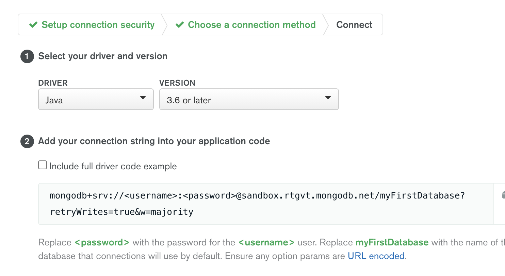

Return to the root of the easy guide [here](..).

# National Telecom Config
Now that you have an understanding of the config file, we can start making one for this exercise.

Download this [sample/skeleton config template](https://github.com/mcinteerj/rdbms-mdb-migration-workshop/blob/main/resources/template-config.json) and use it as the basis to build your own configuration for this exercise. 

In the following step, you will run MongoSyphon with your config file in order to migrate the data to your cluster.

The steps below go through how to set up each section of the configuration file. 

## Source
The first section of the template is already completed for you as follows:
```
"source": {
    "uri": "jdbc:mysql://database-1.cb7xvxwyioz4.eu-west-3.rds.amazonaws.com:3306/telecom?useUnicode=true&useServerPrepStmts=true&useSSL=false",
    "user": "bt-hack",
    "password": "btgameday123!march2021"
}
```

This specifies the required parameters to connect to the MySQL server that you will be extracting data from. We have provided all of the required credentials and connection parameters - **you do not need to edit this**.

## Target
The next section of the template is the `target` section which specifies the parameters required to connect to your Atlas Cluster.

To find your connection string, you will have to go to your cluster's page and click on the "Connect" button:

> 

"Connect your application" choose the Java driver for the 3.6 version (which is used by MongoSyphon). 

> 

At this point, you can click on the copy button and put it in the uri field being **careful to change the <user> and <password> value** to `appUser:AtlasW0rkshop!`.

> 

Finally, you will need to adjust the `namespace` field in order to set the database and collection name you wish to use for this data. You could use 'hackathon' as the DB name and 'customers' as the collection name, like so:
```
    "namespace": "hackathon.customers"
```

If you're looking for more guidance, see the [Target Section of the Easy Guide](../../easy/data-migration/intro-mongosyphon.md#target), then return to continue from here. 

## Template

The next section to complete is the `template` section. This specifies the target document structure which will match the data model you defined in the earlier exercise. 

You will be able to copy in the sample document you create during the data modelling exercise and then update it to use placeholders for the relevant columns in the RDBMs. You can set these placeholders using the format `$column_name`.

If you're looking for more guidance, see the [Template Section of the Easy Guide](../../easy/data-migration/intro-mongosyphon.md#template), then return to continue from here.

## Query

For this exercise in the start section the query will be `'SELECT * FROM customers'` because we want to build our MongoDB Database with one document per Customer. This query will return all of the values contained in the customers table.

If you have a MySQL client, you can test your query directly against the source database to see what the data looks like.

If you're looking for more guidance, see the [Query Section of the Easy Guide](../../easy/data-migration/intro-mongosyphon.md#query), then return to continue from here.

Now that leaves us with the following problem:

> How can we get values from the other tables?

## Sections
To generate data in the schema we want, we need to get the calls and embed them to the right suscriber's document.

That's where the sections come in. MongoSyphon enables you to get a field's value from a section where you can give another template and another query.

### Calls Section
To this end, we are making the `"@callssection"` where we will query the calls and put them into the right document. You can query the calls table in your MySQL shell if you want to see what the data look like.

```
Calls

call_id | subscriber_id | rate_plan_id | connected_party_num | call_duration | date_time_stamp
----------------------------------------------------------------------------------------------
```

You can complete the following skeleton of the `callssection` by adding the relevant fields/columns and query:

```
"callssection":{
	"template": {
        // add fields/columns here
	},
	"query":{
        "sql": // add query here
	},
	"mergeon": "subscriber_id"
}
```

For the keen eye, you will observe that we used `mergeon` merge data from the two tables on the subscriber_id field.

If you're looking for more guidance, see the [Sections Section of the Easy Guide](../../easy/data-migration/intro-mongosyphon.md#sections), then return to continue from here.

### Rate Plan Section
Now there is only the rate_plan left. Our Relational Database has another table which is linked to the calls' one.

For that we can use the previously learned function **nested** in the `callssection`.

Now that you are used to all of the main elements here is the `rateplansection`, as previously, you can query the rate_plan table from your MySQL shell to see what the data looks like:

```
"rateplansection": {
    "template": {
        // add fields/columns here
    },
    "query": {
        "sql": // add query here
    },
    "params": [ "rate_plan_id" ],
    "cached": true
}
```
**To optimize the template we used the ```cached``` funtion to cache the rate_plan table and by doing so limit the trips to the Database**

If you're looking for more guidance, see the [Sections Section of the Easy Guide](../../easy/data-migration/intro-mongosyphon.md#sections), then return to continue from here.

You are now all set to do the migration.

If you are unsure about your file, you can review the [Solution here](https://github.com/mcinteerj/rdbms-mdb-migration-workshop/blob/main/guides/solutions/data-migration/data-migration-solution.json).

## Next Step

Now that you have built your MongoSyphon template, you're ready to head to the next step: [Execute Your Migration](execute-migration.md).