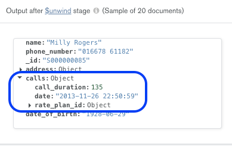
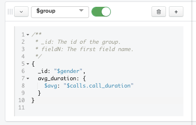
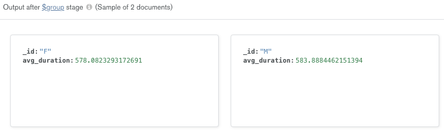

Return to the workshop overview page [here](https://github.com/mcinteerj/rdbms-mdb-migration-workshop/).

# Aggregation Pipeline 
This section provides a detailed solution for the first part of Exercise 3. However, please note that there are many different ways of solving this exercise.

## Aggregation 1: Average Call Duration by Gender 
In this exercise, you were asked to find out the average value of the field ```call_duration``` across all subscribers, categorized by the two values for the field ```gender``` in our database (i.e. ```M```, for Male and ```F``` for 'Female'). 

The Aggregation Pipeline for this exercise can be found below: 

```
[{
    $unwind: {
        path: "$calls"
    }
}, {
    $group: {
        _id: "$gender",
        avg_duration: {
            $avg: "$calls.call_duration"
        }
    }
}]
```

Let us look at the different stages in this aggregation pipeline, by using the Aggregation builder in the Atlas UI or in MongoDB Compass:

1. ```$unwind``` : This operator is used to deconstruct the array field ```calls``` to output a document for each object contained in it. In this case, the objects inside the ```calls``` array represent the data of a call. Therefore, this step is necessary as we wish to analyse the data of all calls made by all subscribers (and not the data of calls grouped together for each subscriber). 
> * The ```$unwind``` operator has the following syntax:
> 
>   ```{ $unwind: <field path> }```
> * While specifying the ```<field path>``` above, you should prefix it with ```$``` and enclose it in quotes.

This is what the first stage of the aggregation pipeline should look like: 
> 

You should now be able to see an output for this stage, which shows a sample of 20 documents. Notice that in each document, there is only one object (i.e. data of only one call) under ```calls```
> 

2. ```$group```: The next step is to divide the data into two groups, based on the two possible values for gender in our data - ```M``` (representing ‘Male’) and ```F``` (representing ‘Female’). For this purpose, we use the ```$group``` operator.
> * The ```$group``` operator has the following syntax: 
  ```
   $group:
      {
        _id: <expression>, // Group By Expression
        <field1>: { <accumulator1> : <expression1> },
        ...
      }
   }
   ```
> * In this case, the ‘_id’ field should have the value ```$gender``` as we wish to group our data based on this field. 
> * In the ```<field>``` argument, we can compute any valid expression using accumulator operators. Since we wish to compute the average of the ```calls.call_duration``` field , we will use the accumulator ```$avg```.    


This is what the second stage of this pipeline should look like:
> 

You should now be able to see two documents in the output, one with the ```_id``` value ```F```, and the other with ```M```. In each of these documents, you will also notice the value of ```avg_duration``` computed by your expression. This is the final result of this aggregation exercise. 

> 

