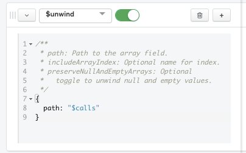
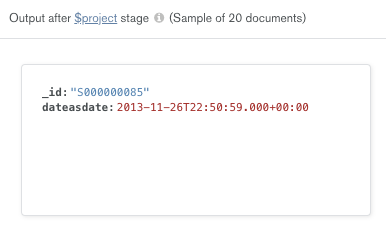
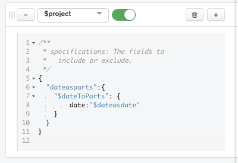
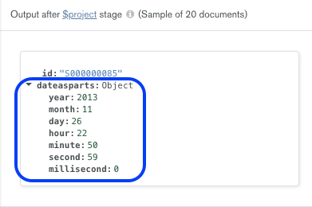
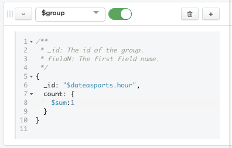
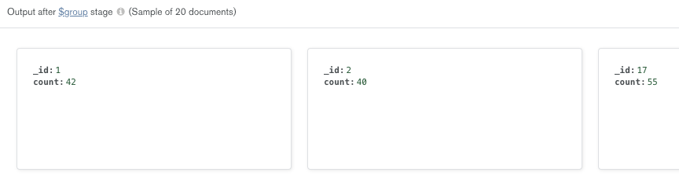
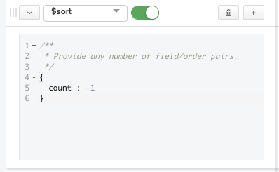
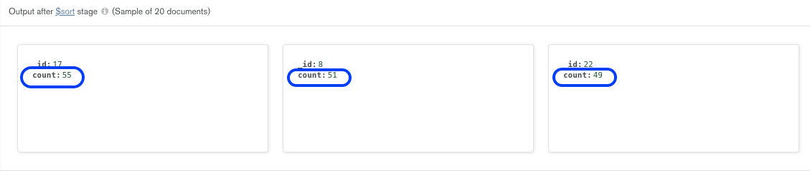
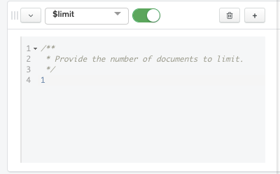
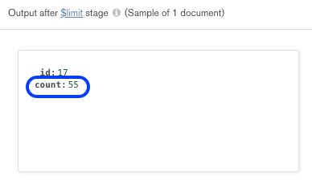

# Aggregation Pipeline 
This section provides a detailed solution for the second part of Exercise 3. However, please note that there are many different ways of solving this exercise.

## Aggregation 2: Peak Calling Time
In this exercise, you were asked to find out the time of the day at which the maximum number of calls were made, by analysing the total number of calls made per hour, across all subscribers.

The Aggregation Pipeline for this exercise can be found below: 

```
[{
    $unwind: {
        path: "$calls"
    }
}, {
    $project: {
        "dateasdate": {
            "$dateFromString": {
                dateString: "$calls.date"
            }
        }
    }
}, {
    $project: {
        "dateasparts": {
            "$dateToParts": {
                date: "$dateasdate"
            }
        }
    }
}, {
    $group: {
        _id: "$dateasparts.hour",
        count: {
            $sum: 1
        }
    }
}, {
    $sort: {
        count: -1
    }
}, {
    $limit: 1
}]

```

Let us look at the different stages in this aggregation pipeline, by using the Aggregation builder in the Atlas UI or in MongoDB Compass:

1. ```$unwind```: This operator is used to deconstruct the array field ```calls``` to output a document for each object contained in it. In this case, the objects inside the ```calls``` array represent the data of a call. Therefore, this step is necessary as we wish to analyse the data of all calls made by all subscribers (and not the data of calls grouped together for each subscriber). 
> * The ```$unwind``` operator has the following syntax:
> 
> ```{ $unwind: <field path> }```
> * While specifying the ```<field path>``` above, you should prefix it with ```$``` and enclose it in quotes. 

This is what the first stage of the pipeline should look like:
> 

You should now be able to see an output for this stage, which shows a sample of 20 documents. Notice that in each document, there is only one object (i.e. data of only one call) under ```calls```
> 

2. ```$project```: This operator is used to specify the inclusion or exclusion of fields, the addition of new fields and/or the resetting of values of existing fields. 
> * The ```project``` stage has the following prototype form: 
>
>```{ $project: { <specification(s)> } }```

In this case, we wish to add a new field ```dateasdate``` that takes the value of ```calls.date```. We also wish to convert the ```date``` value from the data type ```string``` to a ```date``` object, for which we will use the ```$dateFromString``` operator. Hence, this ```$project``` stage in our pipeline should be as follows:
> 

This should result in output documents with the format shown in the image below. Notice that these documents contain the newly added ```dateasdate``` field per document, and the values in this field are of the data type ```date``` object, as we had specified.
> 

3. ```$project```: Since we wish to find out the peak calling time by hour, we now need to further project the ```dateasdate``` field in a format which splits the ```date``` object into its different components. Therefore, we will add another ```$project``` stage to our pipeline, but this time we will use the operator ```$dateToParts```, which returns a document that contains the constituent parts of a given BSON Date value as individual properties.
> 

The resulting documents from this stage should contain a new field ```dateasparts```, containing the individual properties of the ```date``` object, as shown below.
> 

4. ```$group```: The next step is to divide the data into groups, based on the possible values for ```dateasparts.hour``` in our data. For this purpose, we will use the ```$group``` operator.
> * The ```$group``` operator has the following syntax: 
  ```
   $group:
      {
        _id: <expression>, // Group By Expression
        <field1>: { <accumulator1> : <expression1> },
        ...
      }
   }
  ```
> * In this case, the ```_id``` field should have the value ```$dateasparts.hour``` as we wish to group our data based on this field. 
> * In the ```<field>``` argument, we can compute any valid expression using accumulator operators. Since we wish to compute the total number of calls made during the hour, , we will use the ```$sum``` operator.

> 

The documents produced as a result of this stage would have the ```hour``` value as their ```_id``` fields, and in each document, a ```count``` field would be created, containing the result of the ```$sum``` operator. A sample of the results is shown below.
> 

5. ```$sort```: This stage is used to sort all input documents and return them to the pipeline in sorted order.
> * The ```$sort``` stage has the following prototype form:
> ```{ $sort: { <field1>: <sort order>, <field2>: <sort order> ... } }```
>  * ```<sort order>``` can have one of the following values: 
>  >  > * ```1```: To sort in the ascending order
>  >  > * ```-1```: To sort in the descending order

In this case, we wish to find the highest value of ```count``` to be able to determine the peak calling hour, therefore we will use the ```sort order``` value of ```-1``` to arrange the documents by descending order based on the value of ```count```.
> 

In the results, you can observe that the document with ```count``` value ```55``` is placed first, followed by other documents with decreasing values for this field.
> 

6. ```$limit```: This stage limits the number of documents passed to the next stage in the pipeline. 
> * The ```$limit``` stage has the following prototype form:
> ```{ $limit: <positive integer> }```
> * ```<positive integer>``` takes a positive integer value that specifies the maximum number of documents to pass along. 

In this case, since we only require the highest value to find out the peak calling hour, we would pass the value ```1```.
> 

The resulting document contains the field ```_id``` with the value ```17``` and the field ```count``` with the value ```55```. This is the final result of our aggregation pipeline, and it represents that the maximum number of calls (55) in the day are made at the hour 1700.
> 
