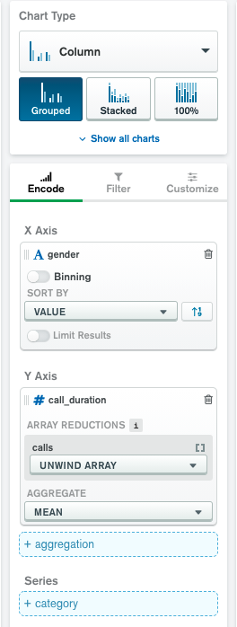
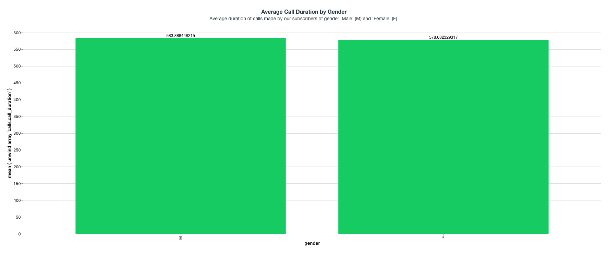
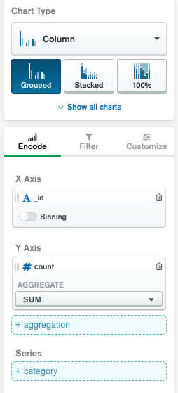
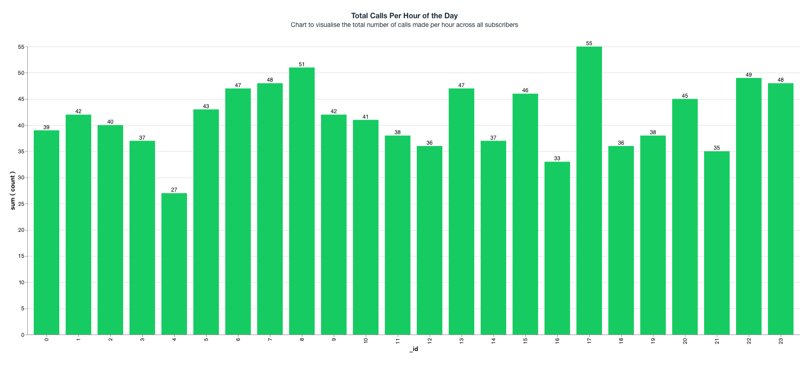

Return to the workshop overview page [here](https://github.com/mcinteerj/rdbms-mdb-migration-workshop/).

# Charts Solution
This section provides a step-by-step guide to come up with a visualization for each of the aggregation queries from Exercise 3. However, please note that MongoDB Charts has a wide range of features, and there are many possible ways to visualize this data. 

## Visualising the first Aggregation Exercise: Average Call Duration by Gender
* Select the ```Hackathon.customers``` collection as your Data Source
* From the ‘Chart Type’ drop-down, select ‘Column’, and select the ‘Grouped’ type.
* Drag the ```gender``` field from the ‘Fields’ panel on the left to the X-Axis field in the ‘Encode’ tab. In the ‘Sort By’ drop down, select ‘Value’  
* Drag the ```call_duration``` field from the ‘Fields’ panel on the left (note: this field can be found under ```calls```) to the Y-Axis field in the ‘Encode’ tab.
* In the ‘Array Reductions’ drop down for calls, choose the method ```Unwind Array```. This is done to obtain one document per call.
* Then, from the ‘Aggregate’ drop down, select ‘Mean’.
* This is what the configuration panel should look like: 
> 
* You should now see a Chart on your screen
* Optionally, you can go to the ‘Customize’ tab and enable ‘Data Value Labels’ under the ‘Chart Elements’. You can also play around with colours and other visual features.  
* Finally, you can give your chart a title by editing the ‘Enter a title’ field, and you may also add a description by editing the ‘Enter a description’ field on the chart.
Here’s what your chart should look like:
> 

## Visualising the first Aggregation Exercise: Average Call Duration by Gender
* Select the ```Hackathon.customers``` collection as your Data Source
* Select ‘Column’ from the Chart Type drop-down list, and then select the type ‘Grouped’
* In the ‘Query’ field, paste the aggregation query from Exercise 3.1. This is done to pre-process your data. One such possible query could be: 
```
db.customers.aggregate(
[
    {
        "$unwind": {
            "path": "$calls"
        }
    },
    {
        "$project": {
            "dateasdate": {
                "$dateFromString": {
                    "dateString": "$calls.date"
                }
            }
        }
    },
    {
        "$project": {
            "dateasparts": {
                "$dateToParts": {
                    "date": "$dateasdate"
                }
            }
        }
    },
    {
        "$group": {
            "_id": "$dateasparts.hour",
            "count": {
                "$sum": 1
            }
        }
    }
]
)
```
* You would notice that after the filtering, only two fields are now available under the ‘Fields’ panel on the left - ```_id``` and ```count```
* Drag the ```_id``` field to the X-Axis variable in the ‘Encode’ tab. You will notice that it automatically enables ‘Binning’, but since we wish to visualise the ```count``` for each hour, we wouldn’t need to use it. Therefore, disable ‘Binning’ 
* Drag the ```count``` field to the Y-Axis. From the ‘Aggregate’ drop-down, select ‘SUM’, as we require the total number of calls for each hour. 
* This is what your configuration panel should look like:
> 
* You should now be able to see a column chart on your screen 
* Optionally, you can go to the ‘Customize’ tab and enable ‘Data Value Labels’ under the ‘Chart Elements’. You can also play around with colours and other visual features. 
* Finally, you can give your chart a title by editing the ‘Enter a title’ field, and you may also add a description by editing the ‘Enter a description’ field on the chart.
* Here’s what your chart should look like:
> 


